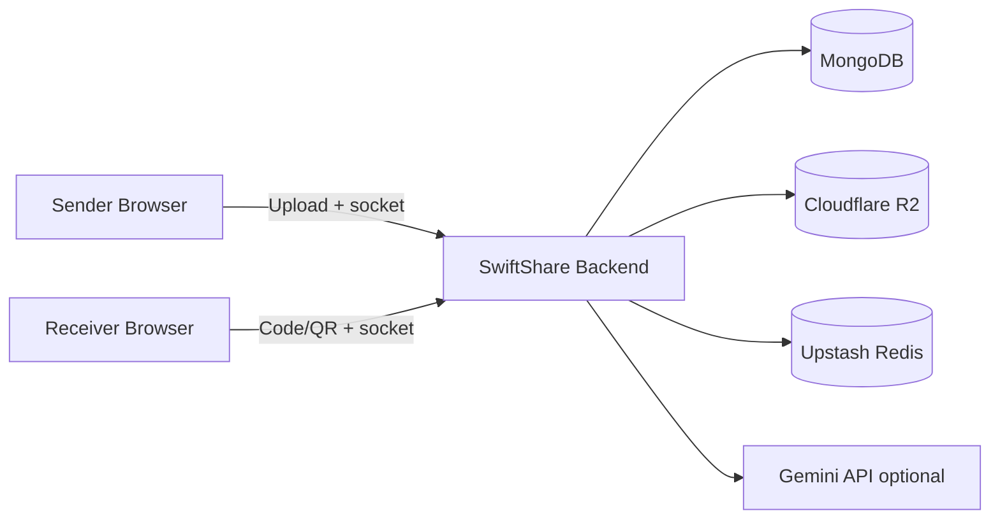

<p align="center">
  
</p>

<p align="center">
  <strong>Fast, secure temporary file sharing with live updates, QR join, password protection, and burn-after-download controls.</strong>
</p>

<p align="center">
  
  
  
  
  
</p>

<p align="center">
  <a href="#overview">Overview</a> |
  <a href="#core-capabilities">Core Capabilities</a> |
  <a href="#architecture">Architecture</a> |
  <a href="#quick-start-local">Quick Start</a> |
  <a href="#deployment-render--vercel">Deployment</a>
</p>

---

## Overview 👋

SwiftShare is the modern file sharing platform for the web, built with responsive native-like design principles.
The UI seemingly blends in with your browsing experience, providing you an uninterrupted, clean, and blazingly fast experience when transferring your files securely.

SwiftShare features smooth animations, blends with your system's color themes and includes a suite of personalization settings while providing live transfer updates, AI summaries, and more in beautiful modern panels.

## Features ✨

- 📂 **Multi-File Transfers:** Share multiple files in one swift session.
- 📱 **Zero-Setup Join:** Jump in from another device using a transfer code or QR code. 
- ⚡ **Real-Time Sync:** Track live events via websockets (countdown, progress, expiry, receipt).
- 🔒 **Secure Sessions:** Protect transfers with an optional password verification step.
- 🔥 **Burn-After-Reading:** Claimant ownership ensures files self-destruct after the first download.
- 👁️ **Smart Previews:** Preview supported file types before completing the download.
- 🤖 **AI Analysis:** Request Gemini AI file analysis/summaries for quick insights.
- 📡 **Nearby Discovery:** Use nearby transfer discovery in compatible network contexts.
- 🎨 **Beautiful Themes:** Switch themes effortlessly from built-in presets.

> *"The gold standard for instant file transfers. No messy drives, no accounts, just pure speed."* — **Tech Reviewer**  
> *"Security, speed, and real-time synchronization elegantly packed into a web app."* — **Developer**

## Architecture 🏗️



## Monorepo Layout 📁

```text
SwiftShare/
  Backend/   # Express API, socket server, transfer lifecycle
  Frontend/  # React app (this folder)
```

## How to install 📥

### 1) Backend 🌱

```bash
cd Backend
npm install
cp .env.example .env
npm run dev
```

Default backend URL: `http://localhost:3001`

### 2) Frontend ⚛️

```bash
cd Frontend
npm install
cp .env.example .env
npm run dev
```

Default frontend URL: `http://localhost:5173`

## Environment 🌍

Frontend example (`Frontend/.env.example`):

```env
VITE_API_URL=http://localhost:3001
VITE_SOCKET_URL=http://localhost:3001
VITE_SHARE_BASE_URL=http://localhost:5173
```

Backend example (`Backend/.env.example`) includes required values for:

- MongoDB (`MONGODB_URI`)
- Cloudflare R2 (`R2_ACCOUNT_ID`, `R2_ACCESS_KEY_ID`, `R2_SECRET_ACCESS_KEY`, `R2_BUCKET_NAME`)
- frontend/share URLs (`FRONTEND_URL`, `SHARE_BASE_URL`)
- optional integrations (`GEMINI_API_KEY`, Upstash Redis, Sentry)

## Deployment (Render + Vercel) 🚀

- Deploy Backend to Render using `Backend/render.yaml`.
- Deploy Frontend to Vercel using `Frontend/vercel.json`.
- Set production env values in each platform dashboard.
- Ensure backend `FRONTEND_URL` matches your frontend domain(s).

## Open Source & Sustainability 💰

SwiftShare is and always will be free and open-source. You can download the latest source code from this repository and compile the project yourself to access the full feature set without restrictions.

Maintaining a full-stack project with AI integrations takes time and effort. Contributions, bug reports, and pull requests are always welcome!

## Credits 🙌

- **Superduash** - Original Developer & Maintainer

## Dependencies 📦

- `@tanstack/react-query`
- `framer-motion`
- `socket.io-client`
- `react-router-dom`
- `tailwindcss`
- `vite`

---

<p align="center">
  Built with 💖 by Superduash
</p>
