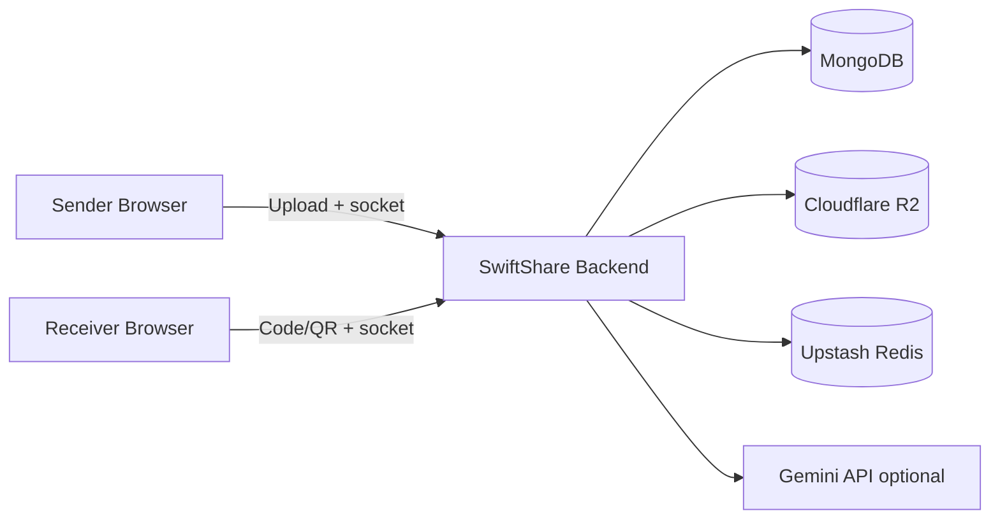

<p align="center">
  
</p>

<p align="center">
  <strong>Fast, secure temporary file sharing with live updates, QR join, password protection, and burn-after-download controls.</strong>
</p>

<p align="center">
  
  
  
  
  
</p>

<p align="center">
  <a href="#overview">Overview</a> |
  <a href="#core-capabilities">Core Capabilities</a> |
  <a href="#architecture">Architecture</a> |
  <a href="#quick-start-local">Quick Start</a> |
  <a href="#deployment-render--vercel">Deployment</a>
</p>

---

## Overview

SwiftShare is a full-stack transfer app for short-lived file sharing between devices.
It combines a modern React UI with an Express + Socket.IO backend to deliver:

- one-time transfer codes and QR join links
- real-time transfer status and countdown updates
- password-protected sessions
- optional burn-after-download behavior
- preview + AI summary flows for supported files

The frontend in this folder is the main user-facing application for senders and receivers.

## Core Capabilities

- Share multiple files in one session with an expiry timer.
- Join from another device using transfer code or QR.
- Track live events via websockets (countdown, progress, expiry, receipt).
- Protect transfers with an optional password verification step.
- Use burn-after-download mode with claimant ownership and finalize behavior.
- Preview supported file types before download.
- Request AI file analysis/summaries when enabled by backend env.
- Use nearby transfer discovery in compatible network contexts.
- Switch themes from built-in presets.

## Architecture



## Monorepo Layout

```text
SwiftShare/
  Backend/   # Express API, socket server, transfer lifecycle
  Frontend/  # React app (this folder)
```

## Quick Start (Local)

### 1) Backend

```bash
cd Backend
npm install
cp .env.example .env
npm run dev
```

Default backend URL: `http://localhost:3001`

### 2) Frontend

```bash
cd Frontend
npm install
cp .env.example .env
npm run dev
```

Default frontend URL: `http://localhost:5173`

## Environment

Frontend example (`Frontend/.env.example`):

```env
VITE_API_URL=http://localhost:3001
VITE_SOCKET_URL=http://localhost:3001
VITE_SHARE_BASE_URL=http://localhost:5173
```

Backend example (`Backend/.env.example`) includes required values for:

- MongoDB (`MONGODB_URI`)
- Cloudflare R2 (`R2_ACCOUNT_ID`, `R2_ACCESS_KEY_ID`, `R2_SECRET_ACCESS_KEY`, `R2_BUCKET_NAME`)
- frontend/share URLs (`FRONTEND_URL`, `SHARE_BASE_URL`)
- optional integrations (`GEMINI_API_KEY`, Upstash Redis, Sentry)

## Deployment (Render + Vercel)

- Deploy Backend to Render using `Backend/render.yaml`.
- Deploy Frontend to Vercel using `Frontend/vercel.json`.
- Set production env values in each platform dashboard.
- Ensure backend `FRONTEND_URL` matches your frontend domain(s).

## Scripts

Frontend scripts:

```bash
npm run dev      # start Vite dev server
npm run build    # production build
npm run preview  # preview production build
```

Backend scripts are documented in `Backend/README.md`.

## Notes

- Node engine requirements:
  - Frontend: `>=20`
  - Backend: `>=22`
- Health endpoint: `GET /api/health`
- Ping endpoint: `GET /api/ping`

---

<p align="center">
  Built by Superduash
</p>
